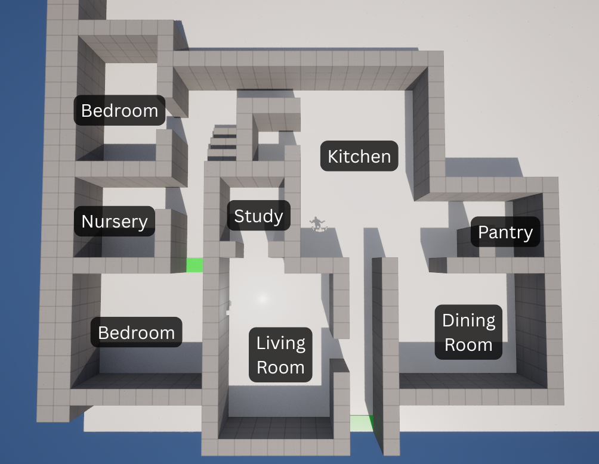
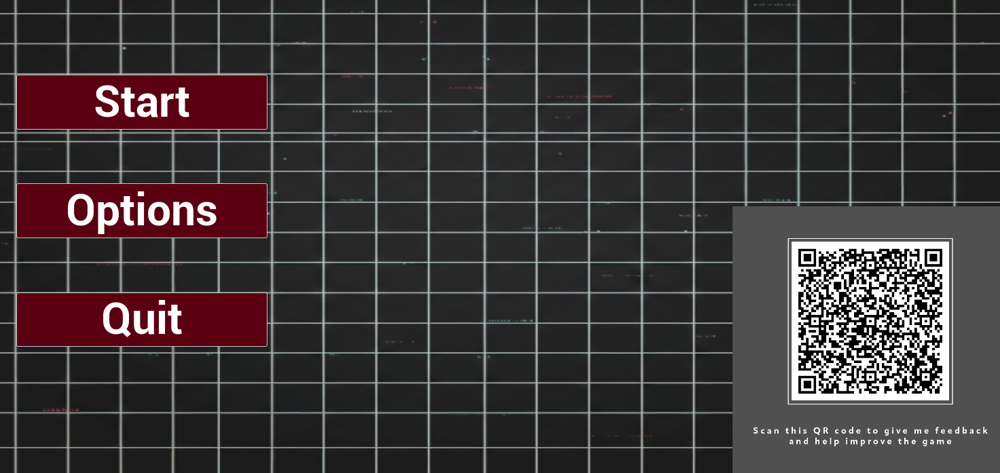

# FMP

Wiktoria Szramkowska

2106125

I really enjoy indie horror and a first person horror game was an obvious choice for my FMP, I have been building the skills I need for this project during the last 2 years of my Games Development course. There is a lot of different directions to go when it comes to indie horror, but I have a few ideas I am keen on implementing such as, a focus on atmospheric horror and an enemy AI which seems to behave intelligently. I first want to do some research to be better informed on what I really want to do with my game and the key mechanics I want to implement. 

## Research

I wanted to look at some video games to get inspiration for my game, specifically horror games that have one "big bad" enemy. Some games that come to mind included Alien: Isolation (Creative Assembly, 2014) and Amnesia: The Bunker (Frictional Games, 2023)
I will of course also be looking at Unreal documentation throughout my project, when I feel stuck with blueprints or anything else, as documentation is a good, official and up to date source.
For my core mechanics I will try to find video tutorials to help me.

#### Sources

#### Alien: Isolation

Alien: Isolation is a survival horror game published in 2014 and developed by Creative Assembly. I chose this game because of the antagonist, the Xenomorph, which remains a benchmark in AI design over a decade later. The developers are able to create the illusion of an intelligent enemy that learns from the player through clever use of complex behaviour trees and a two tier system for the AI (aetos, 2025). I want to use what I have learned to create my own complex enemy that appears to learn from and adapt to the player. 

[How Does The Alien Work Off Camera Alien Isolation](https://youtu.be/MNMAduVsqhQ?si=Xm99RoZNNz3GOLOj)

<iframe width="560" height="315" src="https://www.youtube.com/embed/MNMAduVsqhQ?si=Xm99RoZNNz3GOLOj" title="YouTube video player" frameborder="0" allow="accelerometer; autoplay; clipboard-write; encrypted-media; gyroscope; picture-in-picture; web-share" referrerpolicy="strict-origin-when-cross-origin" allowfullscreen></iframe>

 

#### Unreal Documentation

Another source I will be regularly going to throughout my project is the Unreal Documentation as I believe it has some of the most accurate and up to date information. There are multiple that I will be using depending on the specific mechanics I am trying to implement, one such documentation is the AI Perception system (AI Perception in Unreal Engine | Unreal Engine 5.5 Documentation | Epic Developer Community, s.d.) which I used to help create my enemy AI.

Specifically I looked at AI Hearing and AI Sight. Hearing is handled by calling a 'Report Noise Event' which simulates the NPC hearing a sound. Sight alerts the NPC when player or an object enters the sight radius. 

I will also be using Behaviour Trees to manage the behaviour of my enemy AI. Although I have made games in Unreal Engine before, I actually have not used Behaviour Trees before so I will be frequently referring to documentation.

I started with learning the basics by reading the Quick Start Guide. (Behaviour Tree in Unreal Engine - Quick Start Guide | Unreal Engine 5.7 Documentation | Epic Developer Community, s.d.) which explains how to create an enemy AI in Unreal Engine that patrols the level, detects the player using AI Perception, and switches to chasing them when they are seen. It covers setting up an AI Controller, Blackboard, and Behaviour Tree with tasks for patrolling and chasing, using decorators to control state changes based on line of sight. When the AI loses sight of the player for a set time, it stops chasing and returns to patrolling, demonstrating a complete, reactive AI loop built with Blueprints.

Overall I think documentation is incredibly useful and as it is written on the official site, the information is incredibly accurate and is updated frequently. 

 

#### A survey of Behaviour Trees in robotics and AI

I looked at academic papers, specifically about Behaviour trees to understand the underlying structure, strengths and limitations of Behaviour Trees. *A Survey of Behaviour Trees in Robotics and AI* provided me with a strong academic foundation on understanding Behaviour Trees beyond engine-specific tutorials. The paper covers behaviour tree theory, comparisons with other AI approaches such as finite state machines, and practical applications, making it particularly valuable for implementing complex AI behaviour correctly (Iovino et al., 2022). 

The source is reliable because it is written by established researchers and based on peer-reviewed academic work, providing a strong theoretical foundation for behaviour trees that are still widely used in Unreal Engine. However, it may be slightly outdated, as it does not cover recent engine-specific features or workflows, reflecting how quickly game technology evolves.

## Implementation

#### Planning 

My first goal is to make a prototype which can prove my game idea will work and is executable. I set out a few simple goals to achieve in this stage including a simplified version of the final AI (detects sound, sees player, chases player, patrols), and a working light system. These cover the core mechanics in my game. Other features such as player health and damage, crouching and sprinting, I have already done in previous projects so I am confident I will be able to implement them. 

Since avoiding my enemy AI will be a key mechanic in the game, I gave it a bit more attention during the planning phase. I split my goals into three parts to make them more manageable. The first stage of my Ai is to get it “alive” quickly with a simple patrol loop and perception-driven investigation. The monster reacts to sound and sight, checks the player’s last known location, and returns to patrol, creating a basic but readable hunt loop.

The second stage will increase believability by adding variability and tactics: EQS-driven search points, randomized patrols, and expanding investigation patterns. The monster can stalk, ambush, and pace itself, making searches feel emergent rather than scripted.

The third stage is to elevate the AI to a systemic predator using utility-based decision-making, long-term memory, and adaptive learning. The monster shapes the environment, anticipates player habits, controls territory, and optimizes performance so it feels intelligent, unpredictable, and oppressive rather than omniscient.

 

#### Enemy AI 

My enemy is a core part of the game, most of the tense atmosphere will come from the fact the player is stuck in the house with this monster. I want to build a strong foundation for my enemy before diving into more complex features, so for the prototype I completed stage one of my plan for the AI.

The AI prototype was brought to life with a monster that patrols the house, reacts to sound and light, and hunts the player if its aggression grows too high—laying the foundation for an Alien-Isolation-style intelligent monster. The implementation involved creating a monster pawn with movement and perception components, an AI controller with a blackboard, and a behaviour tree defining Patrol → Investigate → Hunt logic. Perception events update the blackboard, while light triggers increase aggression, causing more aggressive hunting behaviour. After tuning patrol points, wait times, and sensory ranges, the monster exhibits basic but believable sensory-driven behaviour, giving a solid base for more advanced AI in later stages.

Hearing Sense:

*Figure 1. Enemy AI hears noise, moves to noise, finds and chases player*

*Figure 2. Enemy AI hears noise and investigates but doesn't find player*

Sight Sense:

*Figure 3. Enemy AI sees and chases player*

 

#### Building the map

Since this is just a prototype I did not put a lot of focus on the map, however I thought it was important to do a bit of research on horror game maps and how they are built to create a terrifying atmosphere. 

I looked at Resident Evil 7: Biohazard (Capcom, 2017) because it was set in a house and aimed to invoke a sense of claustrophobia, which is something I wanted for my game. The game uses tight, interconnected spaces with limited visibility, forcing the player into close encounters and reducing their sense of control. Its looping layout and narrow corridors make it easy to feel lost or trapped, while blocked paths and locked doors constantly restrict movement. The confined environment, combined with strong sound design and minimal safe areas, keeps tension high and makes the player feel vulnerable throughout exploration.

Although this isn't the final map, I did build a small version with lots of rooms and long corridors which might not make sense in real life, but provide opportunities for tension and possible jumpscares in my game. 

*Figure 4: Current map with labels*

 

#### Light System

I created BP_LightSwitch which is another core mechanic which will interact with the enemy AI. The switch flips on and off, turns the lights in the room on and alerts the monster to the player's potential position. Lights are added to an array so multiple lights can be handled by a single switch if needed. The system is versatile and will make future development much easier. 

*Figure 5: Player flicking light switch*

 

#### Menus and UI

I created a simple Main Menu to start and quit the game. This was enough for my prototype but during further development I will be adding a pause menu and an options menu.

I also added a crosshair in the center of the screen so the player can see what they are pressing, such as the light switches. 

*Figure 6: Player press start*

 

#### Feedback

I asked family, friends and colleagues to test out my game and give me their feedback. Additionally I created a survey on Google Docs and included the QR code link in my game Main Menu. This allows me to collect more data and ask both specific and broad questions to help improve my game. 

As this is just a prototype, feedback has been quite positive with players seeing the game potential. However, atmosphere plays a key part in horror games and is difficult to judge in the prototype phase as there are no visual elements, no house clutter and no post-processing to help sell the horror. 

Now that I have key mechanics down I want to add some visuals so I can more accurately assess if the monster is actually scary when the player crosses paths with it. I also want to add some fog to reduce visibility and give that creepy atmosphere, building further tension.

*Figure 7: QR Code used for feedback*

 

### Technical Difficulties

##### Behaviour Tree

One technical challenge I encountered was getting the Patrol → Investigate → Hunt sequences to transition correctly. Initially, the monster would get stuck patrolling or investigating and never enter Hunt mode, even when it saw the player. I looked at Unreal Documentation (Unreal Engine Behaviour Tree Node Reference: Decorators | Unreal Engine 5.7 Documentation | Epic Developer Community, s.d.) and found the issue was caused by the Behaviour Tree not interrupting lower-priority tasks when Hunt conditions were met. To fix this, I removed the aggression decorator, and configured the Decorator Abort rules so that the Hunt sequence could interrupt Patrol or Investigate immediately. This ensured the monster would respond dynamically to the player, creating a functional Patrol → Investigate → Hunt loop.

##### Aggression

Another challenge was making the monster react correctly to lights. At first, it either ignored lights or went into Hunt too soon. By adjusting how much lights increased its Aggression Level and setting proper thresholds in the Behaviour Tree, the monster would now investigate lights first and only hunt the player when aggression was high enough. I will have to keep tweaking this as I develop the game and figure out how many rooms and lights there will be. 

## Outcome

I think this is a successful prototype for my game, it demonstrates the core mechanics I will be including and lays a solid foundation for the 'star' of the game, the enemy AI. 

Although the map is empty and well lit, I have still managed to be scared by the enemy AI on occasion, standing directly behind me or rounding a corner unexpectedly. I think this supports not only my technical ability to complete the game, but the ability to create tension, horror and authentic jumpscares. 

*Figure 8: Longer video of prototype outcome*

## Reflection and Next Steps

My main goal for the prototype was to create a solid foundation for my AI which I think I achieved. I successfully brought the monster to life with basic patrol, perception, and Hunt behavior. While tuning the Behavior Tree and aggression logic presented challenges, overcoming them ensured the monster reacts to the player in a believable way, creating a solid base for more advanced AI. 

For my next steps I will be blocking out the full map and implementing the rest of the game mechanics such as crouching, hiding, improving the light system and creating objectives for the player to complete and progress through the house. Once these are finshed I will be further improving my enemy AI, using EQS for smarter search points, randomized patrols, expanding investigation patterns, and introducing stalking and ambush mechanics to make the monster’s behavior feel less predictable and more engaging.

I will also be adding visuals to my game, 3D models, animations and post-processing. These will help me and play testers picture the final game and judge how scary it actually is.

Overall I think I have a solid foundation to build the rest of my game on, the prototype has shown me that I have the skills and understanding needed to tackle the more complex behaviors in later phases, giving me confidence that I can create the rest of the game.

## Bibliography

aetos (2025) The Illusion of Intelligence: A Technical Breakdown of Alien: Isolation’s AI. At: https://medium.com/@aetosdios27/the-illusion-of-intelligence-a-technical-breakdown-of-alien-isolations-ai-b2d7c9927d02 (Accessed  11/12/2025).

How Does The Alien Work Off Camera Alien Isolation (2023) Directed by Slippy Slides. At: https://www.youtube.com/watch?v=MNMAduVsqhQ (Accessed  11/12/2025).

Thompson, T. (2025) Revisiting the AI of Alien: Isolation. At: https://www.aiandgames.com/p/revisiting-alien-isolation (Accessed  11/12/2025).

Alien: Isolation - The Retrospective | AI and Games (2025) Directed by AI and Games. At: https://www.youtube.com/watch?v=LeIkEoHglQQ (Accessed  11/12/2025).

Behavior Tree in Unreal Engine - Quick Start Guide | Unreal Engine 5.7 Documentation | Epic Developer Community (s.d.) At: https://dev.epicgames.com/documentation/en-us/unreal-engine/behavior-tree-in-unreal-engine---quick-start-guide (Accessed  27/12/2025).

Iovino, M., Scukins, E., Styrud, J., Ögren, P. and Smith, C. (2022) 'A survey of Behavior Trees in robotics and AI' In: Robotics and Autonomous Systems 154 p.104096.

Unreal Engine Behavior Tree Node Reference: Decorators | Unreal Engine 5.7 Documentation | Epic Developer Community (s.d.) At: https://dev.epicgames.com/documentation/en-us/unreal-engine/unreal-engine-behavior-tree-node-reference-decorators (Accessed  27/12/2025).

How to Create an Interaction System in Unreal Engine 5 | UE5 Interaction Tutorial (2024) Directed by HALbot Studios. At: https://www.youtube.com/watch?v=7OmgBa-cKro (Accessed  18/11/2025).

## Declared Assets

Used to assist in finding and summarising research material:
Chat GPT
