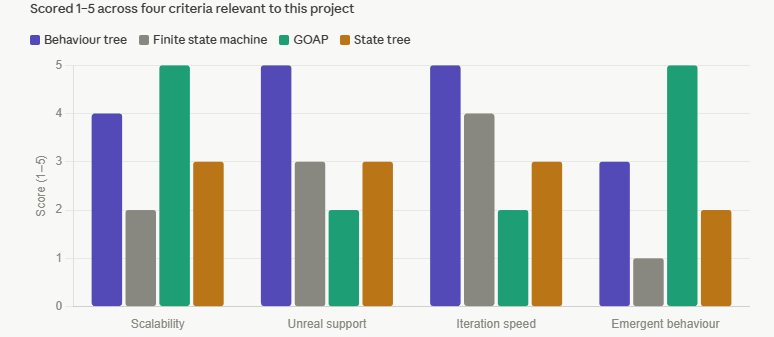
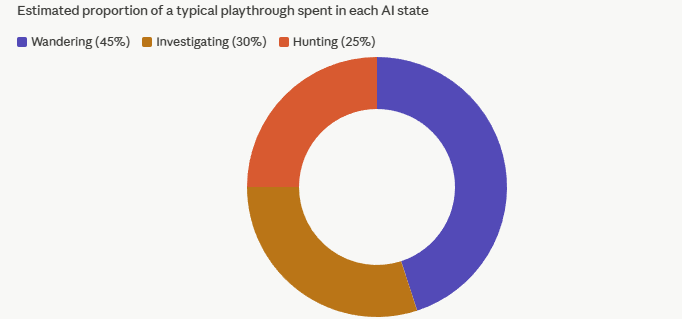
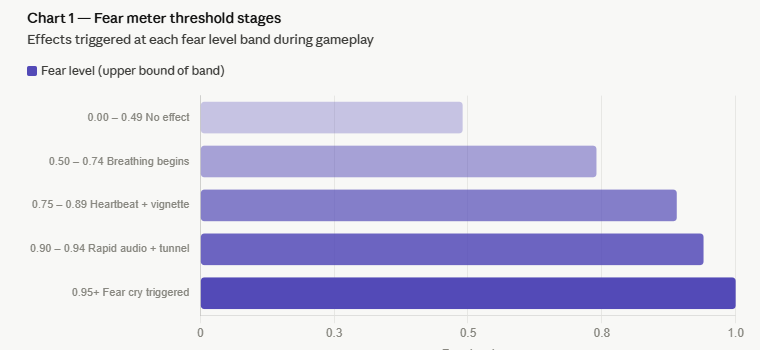
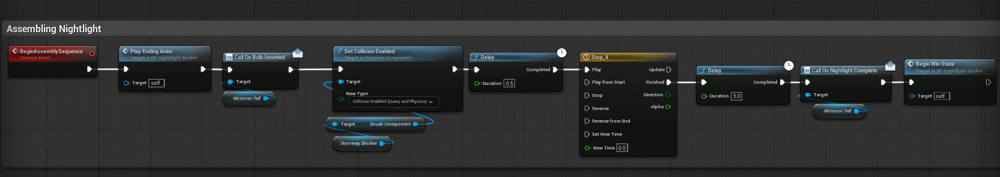
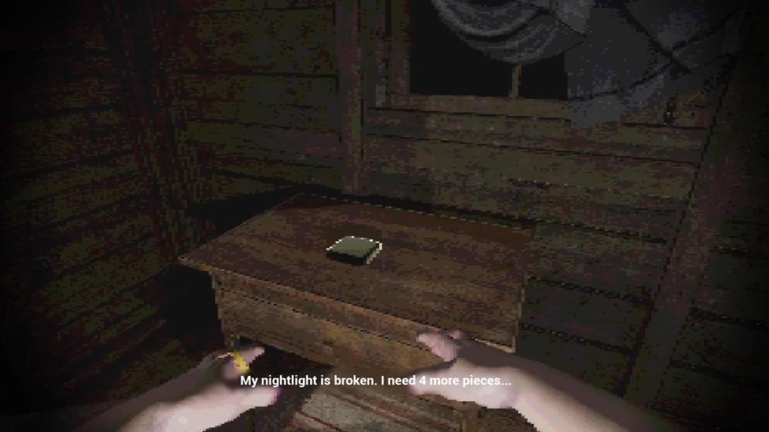
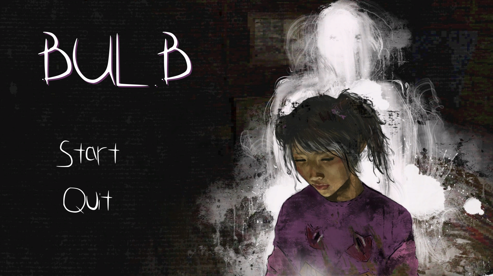
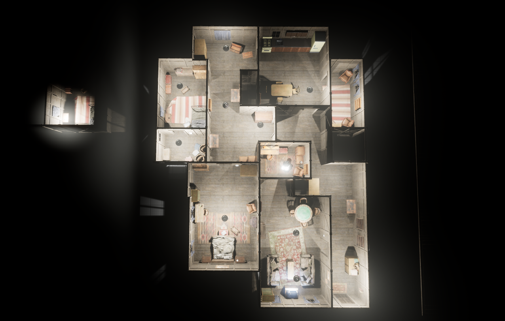
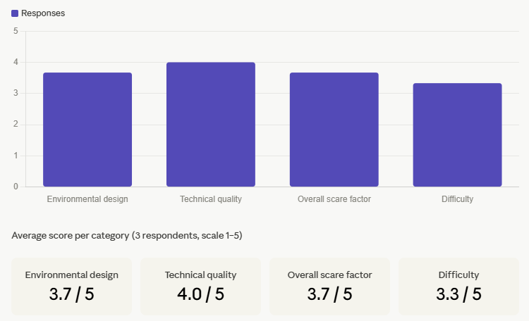

# Bulb

**Unit Name:** Final Major Project

**Student Name:** Wiktoria Szramkowska

**Student ID:** 2106125

**Total Word Count:** [4256]

**Documentation Link:** https://wszramkowska.github.io/FMP/

**Repository Link:** https://github.com/wszramkowska/FMP

**Build Link:** https://squlddy.itch.io/bulb

<iframe frameborder="0" src="https://itch.io/embed/4600271" width="552" height="167"><a href="https://squlddy.itch.io/bulb">Bulb by squiddy</a></iframe>

**Video Demonstration Link:** [Gameplay Demo](https://youtu.be/_-xA4pgAU2M?si=VA0HNOtpgCsu0hWq)

<iframe width="560" height="315" src="https://www.youtube.com/embed/_-xA4pgAU2M?si=VA0HNOtpgCsu0hWq" title="YouTube video player" frameborder="0" allow="accelerometer; autoplay; clipboard-write; encrypted-media; gyroscope; picture-in-picture; web-share" referrerpolicy="strict-origin-when-cross-origin" allowfullscreen></iframe>

## Abstract

*Bulb* is a first-person atmospheric horror game developed in Unreal Engine 5, built as my Final Major Project. The game places the player inside a dark, claustrophobic house, hunted by a single intelligent monster. The central design goal was to create a believable, threatening enemy AI — one that feels reactive and unpredictable — supported by an environmental light system that directly feeds into the monster's awareness. 

My approach began with targeted research into existing AI architectures and horror game design, before moving into a structured prototype phase. The prototype focused on delivering three core mechanics: a perception-driven enemy AI with Patrol → Investigate → Hunt behaviour, an interactive light switch system that influences enemy aggression, and a basic playable map. These mechanics were validated through informal playtesting and a feedback survey embedded in the game's main menu. The prototype successfully demonstrated that the core loop — avoiding a reactive, sound-and-sight-driven monster inside a confined space — is both technically achievable and genuinely tense to play. This commentary documents that process in full, from research through to reflection and next steps.

## Research

### What sources or references have you identified as relevant to this task?

My research focused on two things: understanding how to build a convincing horror game enemy, and deciding which AI architecture in Unreal Engine was the right tool to do it with. I drew from a mix of source types — commercial games, official engine documentation, academic papers, and developer talks — each chosen because it addressed a specific gap in my knowledge.

I deliberately avoided sources that were too general or surface-level. Blog posts with no citations or anonymous forum replies were largely set aside in favour of primary sources: official documentation, peer-reviewed papers, and developer postmortems. The exception was the Medium article on Alien: Isolation's AI (aetos, 2025), which I included because its technical breakdown was specific and applicable to my project. 

The research informed three key decisions: the choice of Behaviour Trees over alternatives like GOAP or FSMs; the perception model (combining sight and hearing with explicit occlusion checks); and the structural approach to the Behaviour Tree itself, favouring deterministic branching with randomised parameters rather than random branching logic.

#### Sources

#### Alien: Isolation *(Creative Assembly, 2014)*

Alien: Isolation is a survival horror game developed by Creative Assembly and published by SEGA in 2014. It is widely regarded as one of the most technically sophisticated horror games ever made, largely because of its enemy AI. I chose it as a primary case study because the Xenomorph antagonist is still referenced as a benchmark in AI design over a decade later, which made it directly relevant to my own goal of creating a single intelligent monster.

The Xenomorph uses a two-tier AI system: a high-level director AI that knows the player's position and feeds cues to the Xenomorph without giving it omniscience, and a low-level creature AI that reacts to sensory stimuli. This two-tier design creates the illusion of learning and intelligence without the creature ever actually tracking the player directly — a key design insight I wanted to carry into my own game. The creature uses sight, sound, and smell, each with different radii and reliability, meaning the player has multiple ways to manipulate its behaviour. The game's tension comes as much from the *possibility* of the creature as from its actual presence — a lesson in restraint I took seriously when tuning my own monster's patrol and investigation behaviour.

<iframe width="560" height="315" src="https://www.youtube.com/embed/MNMAduVsqhQ?si=Xm99RoZNNz3GOLOj" title="YouTube video player" frameborder="0" allow="accelerometer; autoplay; clipboard-write; encrypted-media; gyroscope; picture-in-picture; web-share" referrerpolicy="strict-origin-when-cross-origin" allowfullscreen></iframe>

[How Does The Alien Work Off Camera Alien Isolation](https://youtu.be/MNMAduVsqhQ?si=Xm99RoZNNz3GOLOj) 

*Figure 1: Slippy Slides (2023) — How Does The Alien Work Off Camera? A breakdown of the Xenomorph's off-screen behaviour.*

This source was extremely useful as a design reference. Its main limitation is that it describes a finished, AAA commercial product with a large team and years of iteration. I was conscious not to over-scope my own AI based on a benchmark I could not realistically match, and instead focused on the *principles* — sensory layering, the hunt loop, and the value of imperfect knowledge — rather than the implementation details.
 

#### Resident Evil 7: Biohazard *(Capcom, 2017)*

Resident Evil 7 is a first-person survival horror game set in a dilapidated house. I looked at it specifically because it shares my setting — a confined residential building — and is considered a masterclass in environmental horror design.

- The game uses tight, interconnected rooms with limited visibility to force close encounters and reduce the player's sense of control
- Its looping layout and narrow corridors create a sense of disorientation and vulnerability even in already-explored spaces
- Blocked paths and locked doors are used deliberately to restrict player agency and heighten claustrophobia
- Minimal safe zones and strong sound design keep tension elevated during exploration, not just during enemy encounters

This directly influenced how I approached my prototype map. Although the prototype map is early-stage and functional rather than polished, I consciously built it with long corridors and interconnected rooms rather than a simple open floor plan, prioritising tension over spatial logic.
 

#### Unreal Engine Documentation

Unreal Engine's official documentation, published and maintained by Epic Games, was the primary reference for implementation throughout the project. I returned to it repeatedly rather than treating it as a one-time starting point.

The most relevant areas were:

- **AI Perception** (UE 5.5 Documentation): Used to implement the hearing and sight senses. Hearing is triggered via `Report Noise Event`, which simulates a sound at a world position and notifies nearby AI. Sight uses a cone-based check that fires `OnTargetPerceptionUpdated` on the AI Controller when the player enters the field of view
- **Behaviour Tree Quick Start Guide** (UE 5.7 Documentation): My entry point for Behaviour Trees, which I had not used before this project. It covers AI Controller, Blackboard, and BT setup, including patrol tasks, chasing, and decorator-controlled state transitions
- **Behaviour Tree Node Reference: Decorators** (UE 5.7 Documentation): Returned to specifically when debugging the state-transition bug described in Technical Challenges

Documentation was consistently the most accurate source available. Its main limitation is that it describes systems in isolation — it does not explain how to combine AI Perception, a Behaviour Tree, an aggression system, and a Blackboard into a cohesive whole. That integration required additional experimentation.

---

#### A Survey of Behaviour Trees in Robotics and AI *(Iovino et al., 2022)*

This peer-reviewed paper, published in *Robotics and Autonomous Systems*, provided a theoretical foundation for Behaviour Trees beyond what engine documentation covers. The authors compare BTs against other AI architectures including Finite State Machines, with both formal definitions and practical analysis.

BTs are hierarchical and modular: composed of composite nodes (sequences, selectors, parallels), decorators, and leaf tasks, making them easier to extend and debug than FSMs as complexity grows. BTs are fundamentally reactive, they evaluate current world state on each tick rather than planning ahead, which is a meaningful limitation for complex goal-directed behaviour. The paper compares BTs favourably to FSMs for systems that need to grow in complexity over time, which was relevant given my three-stage AI development plan.

The paper is reliable because it is peer-reviewed and written by established researchers. Its main limitation is that it is engine-agnostic, so I had to translate the theoretical structure into Blueprint practice using documentation and tutorials.

---

#### Comparative AI Architectures and System Selection

Alongside the above, I researched the available AI architectures within Unreal Engine to justify the choice of Behaviour Trees (Yannakakis, 2018).

**Finite State Machines (FSMs)** are the simplest approach, effective for small phase-driven systems. Their drawback is scalability — transition complexity grows rapidly with the number of states.

**Behaviour Trees** are Unreal's established pattern for perception-driven agents. Hierarchical and reactive, with the Blackboard as a centralised data layer. Their limitation is that they react to current world state rather than constructing plans. (Behavior Tree in Unreal Engine - Overview | Unreal Engine 5.7 Documentation | Epic Developer Community, s.d.)

**State Trees** (UE5) combine elements of FSMs and BTs with stronger visual authoring tools, but their Blueprint integration is less mature.

**Goal Oriented Action Planning (GOAP)** — used in *F.E.A.R.* — gives agents a goal and a library of actions, then plans a sequence to satisfy them. This produces emergent behaviour but carries significant runtime cost. For a single-enemy horror game, the CPU cost of runtime A* planning was difficult to justify, and Behaviour Trees offer faster iteration through Unreal's native debugging tools. (Orkin, 2006)

*Figure 2: Slippy Slides (2023) — Comparative scoring of AI architectures considered during research. Behaviour Trees scored highest across the criteria most relevant to a single-enemy horror game — scalability, native Unreal support, and fast iteration.*
---

## Implementation

### Planning

Before writing any Blueprints, I identified the minimum mechanics needed to validate the concept:

- An enemy AI with Patrol → Investigate → Hunt behaviour, reacting to sound and sight
- A Fear system that runs independently and creates a second pressure on the player
- A light switch system where activating lights alerts the enemy and raises aggression
- Nightlight piece collection as the win-condition objective
- Opening and closing Level Sequences for atmosphere
- Animation Blueprints for character and entity movement
- UI elements communicating fear state and nightlight progress

---

### Enemy AI — Missing Parent

The entity is the central feature of the game. Almost all tension in *Bulb* comes from being locked in the house with it, so the AI needed to feel reactive and believable even at this stage.

The implementation involved:

- A Monster Pawn with movement and `UAIPerceptionComponent` configured for both hearing and sight
- An AI Controller (`BP_MonsterAIController`) with a Blackboard (`BB_Monster`) holding keys for `AIState`, `LastKnownSoundLocation`, `LastKnownPlayerLocation`, and `bCanSeePlayer`
- A Behaviour Tree (`BT_Monster`) defining the Patrol → Investigate → Hunt logic
- Perception events updating Blackboard keys to drive tree transitions
- A light trigger system incrementing an Aggression float, pushing the monster toward Hunt when a threshold is exceeded

**Hearing Sense:**

When the player creates noise — activating a light switch, for example — the Blueprint calls `Report Noise Event` at the interaction location. If the stimulus falls within range, `OnTargetPerceptionUpdated` fires on the AI Controller. The handler updates the Blackboard with a `bHeardSound` flag and a `LastKnownLocation` vector, which the Behaviour Tree reads to transition into the Investigate sequence.

*Figure 3. Enemy AI hears noise, moves to noise, finds and chases player*

*Figure 4. Enemy AI hears noise and investigates but doesn't find player*

**Sight Sense:**

The AI uses a cone-based sight sense. When the player enters the monster's field of view and is not occluded, `OnTargetPerceptionUpdated` fires and the Blackboard is updated with the player actor reference, immediately triggering Hunt via decorator abort rules. When the player is out of sight for ten continuous seconds, the monster downgrades to Searching at the last known location.

*Figure 5. Enemy AI sees and chases player*

*Figure 6: Observed entity state distribution across a typical playthrough. The monster spending the majority of time wandering is intentional — prolonged hunting would feel relentless rather than tense.*

 

---

#### Light System

`BP_LightSwitch` handles the interaction between player and in-world lights. When activated:

- All lights referenced in the switch's array toggle on or off (supporting multiple lights per switch)
- A `Report Noise Event` fires at the switch location, alerting nearby enemies to investigate
- The monster's Aggression float increments by a configurable amount per activation

This makes lights a dual-purpose mechanic: visibility versus safety. The system is modular — new rooms only require placing a `BP_LightSwitch` actor and assigning the relevant lights to its array.

*Figure 7: Player flicking light switch*

 

--- 

### Fail-Light System — The Monster Extinguishes Lights

One of the more unsettling mechanics in the game is that the monster can turn lights off on its own. I simulate this by having a timer on my lightswitch manager which will turn off the lights at random. This was a good way to get the mechanic in the game and testable.

For a release build I would like to test turning off lights only within a certain range of the monster. 

The design intent is that players gradually learn this is happening through observation rather than being told. A light they left on is now off. The house is actively working against them. Combined with the Fear system, this creates situations where the player must choose between turning a light back on — risking the noise — or staying in growing darkness as their fear climbs.

*Figure 8: Light turns off without player touching lightswitch, caused by the entity*

 

---

### Fear System — BP_FearComponent

The Fear Meter runs as an Actor Component (`BP_FearComponent`) on the player character, operating entirely independently of the AI. It creates a second kind of threat: the player can be completely hidden from the monster and still lose.

The system works on a float variable `FearLevel` (0.0–1.0, default 0.0), ticked every frame:

- **In darkness:** `FearLevel` rises by `FearRiseRate` per second (base: 0.025/s)
- **In light:** `FearLevel` falls by `FearFallRate` per second (base: 0.04/s)
- A bool `bIsInDarkness` is set by checking whether any active light overlapping the player's current room is on

As `FearLevel` climbs, the HUD and audio respond in stages:

| Fear Level | Effect |
|-----------|--------|
| 0.0 – 0.49 | Normal. No feedback. |
| 0.50 – 0.74 | Circle vignette narrowing player vision. |
| 0.75 – 0.89 | Screen vignette deepens. |
| 0.90 – 0.94 | Rapid breathing, vignette pulsating. |
| 0.95+ | **Fear Cry** — child emits a loud sob, broadcasting a high-intensity Sound Event. Fear resets to 0.5. |

*Figure 9: Fear meter threshold reference.*

void UFearComponent::UpdateFear(float DeltaTime)
{
	// Fear increase/decrease

	if (bIsInDarkness)
	{
		FearLevel += FearRiseRate * DeltaTime;
	}
	else
	{
		FearLevel -= FearFallRate * DeltaTime;
	}

	// Clamp
	FearLevel = FMath::Clamp(FearLevel, 0.0f, 1.0f);

	// Broadcast to Blueprints
	OnFearChanged.Broadcast(FearLevel);

	// Cry trigger

	if (FearLevel >= 0.95f && bCanCry)
	{
		HandleCry();
	}
}

This increases fear when the player is in darkness, reduces fear when the player is safe in light and clamps fear between 0.0 and 1.0. Broadcast is used for fear changes to UI and visual systems. HandleCry is in charge of the logic when a panic cry is triggered when fear reaches a critical threshold.

void UFearComponent::HandleCry()
{
	bCanCry = false;

	// Reset fear after crying
	FearLevel = 0.5f;

	// Notify Blueprint for audio/animation and stuff
	OnCry.Broadcast();

	// Broadcast updated fear
	OnFearChanged.Broadcast(FearLevel);

	// Cooldown before next cry
	GetWorld()->GetTimerManager().SetTimer(
		CryCooldownTimer,
		[this]()
		{
			bCanCry = true;
		},
		3.0f,
		false
	);
}

This code snippet prevents repeated cries using a cooldown, resets fear after the panic event and broadcasts events to Blueprint systems allowing audio, animation, and AI reactions to be triggered
Re-enables crying after a delay using Unreal’s Timer Manager

Using an Actor Component allowed me to keep the fear system independent from the player character logic. 

The Fear Cry is the most dangerous consequence: it fires a `Report Noise Event` with a very large radius regardless of where the entity currently is, pulling it toward the player's position even if it had been on the opposite side of the house. This means a player who has successfully avoided the monster can still fail by staying in darkness too long — or by hiding inside a dark wardrobe for extended periods.

*Figure 9: Fear meter threshold bands and associated player feedback effects. At 0.95+ the child emits a cry, broadcasting a noise event across the full map.*

The vignette effect is implemented as a Post Process Material, darkening the screen edges proportionally to `FearLevel`, giving a visual feedback loop that feels claustrophobic as fear rises.

*Figure 10: Demnonstration of the vignette post process caused by increasing fear.*
---

### Animation Blueprints

Animation Blueprints control the movement animations for both the player character and the entity. Rather than playing single animations directly, the Animation Blueprint evaluates state variables each frame and blends between states accordingly.

**Player Character Animation Blueprint:**

The player's Animation:

- Idle and walking
- An interaction reach animation triggered on the `Interact` event
- Opening/closing wardrobe doorss

**Entity Animation Blueprint:**

The monster's Animation:

- **Wandering:** slow, deliberate walk cycle — intentionally slightly wrong in cadence
- **Idle**: Hunched over pose, human but unnatural.

---

### Level Sequences — Opening and Closing Cinematics

Level Sequences were used to create the opening and closing cinematics that frame the gameplay experience, giving the game narrative context without any dialogue.

**Opening Sequence:**

The opening Level Sequence plays automatically when the level loads, before the player has control. It uses camera cuts and a Timeline-driven fade to establish the scene: the child's bedroom at night, the broken nightlight, the house dark beyond the door. The sequence is kept short — under ten seconds — so it communicates atmosphere without delaying the player. At the end of the sequence, control is handed to the player and the HUD fades in.

*Figure 11: Intro Level Sequence played at the start of the game.*

**Closing Sequence (Win State):**

When the player inserts the final nightlight piece into the socket:

- The nightlight components are animated to piece together.
- The assembly is locked — the player cannot cancel or move
- A warm amber Point Light fades up from the socket using a Timeline
- The entity, wherever it is in the house, begins moving toward the bedroom

**Game Over Sequence:**

When the entity catches the player, a short death sequence plays where the entity jumpscares the player.

*Figure 12: Death Level Sequence played when monster catches player.*

---

### Nightlight System

Player must collect 4 pieces of their nightlight scattered across the house. Once all pieces are collected the player brings them back to the bedroom to assemble them, fix the nightlight and finally return to bed, winning the game.

`PiecesCollected`, `RegisterPiece`, `OnNightlightComplete` and `OnBulbInserted` are Event Dispatchers in `GI_Horror`. This is ussed to communicate with `BP_NightlightSsocket` which handles the end of game sequencess. 

*Figure 13: Blueprint for the AssemblySequence which begins the game win state.*

*Figure 14: Early testing of the nightlight collection. All 4 pieces are collected then assembly begins with placeholder timelines.*

**Nightlight Socket UI:**

When the player looks at and interacts with the nightlight socket on the bedroom wall, a UI message appears displaying how many pieces have been collected and how many remain — for example: *2 / 4 pieces collected. Keep searching.* This was implemented as a Widget Blueprint that is displayed briefly on interact and then fades out, keeping the HUD uncluttered the rest of the time. The interaction uses the same line-trace system as all other interactable actors, with the socket responding to the `Interact` interface event.

I display it as a text at the botton of the screen to simulate the player speaking, I thought this would be a good way to communicate the objective to the player without completely breaking immersion. 

*Figure 14: UI which indicates player objective, viewed upon interacting with nightlight socket where player must assemble nightlight.*

---

#### Menus and UI

A main menu with Start and Quit options was built using a Widget Blueprint (`WBP_MainMenu`). It also contains a QR code linking to the playtesting feedback survey.

*Figure 15: Player press start*

*Figure 16: Final Main Menu.*

 

---

### Map

The prototype map was built to support the core mechanics rather than to be a finished environment. I referenced Resident Evil 7's design approach — interconnected rooms, limited visibility, and long corridors — to build a layout that creates tension without requiring visual polish.

The map includes six planned rooms: Child's Bedroom, Hallway, Kitchen, Bathroom, Living Room, and Parents' Bedroom. Rooms are connected by corridors designed so the player can hear the monster approaching without seeing it. Room sizing ensures there is rarely a clear sightline across the full space. The rooms ended up changing as I was scene dressing to better ssuit the game in its final phases.

*Figure 17: Prototype map with labels*

*Figure 18: Final map layout*

 

---

### Technical Challenges

#### Behaviour Tree Transition Bug

The most significant technical problem was the Patrol → Investigate → Hunt transition failing silently. The monster would enter Patrol or Investigate but never transition into Hunt, even with the player in direct line of sight.

After reviewing the Unreal Behaviour Tree Decorator documentation, I identified the cause: the Hunt sequence's decorator was not configured to abort lower-priority tasks. The tree was finding Hunt conditions met but, with no abort rule set, the current Patrol or Investigate task was allowed to complete before re-evaluation — meaning Hunt was only entered between tasks, not immediately.

The fix involved removing the aggression-based decorator gating Hunt entry and setting the remaining decorator's `Abort Type` to `Lower Priority`. This allowed Hunt to interrupt Patrol or Investigate the moment its conditions were satisfied.

##### Aggression

Another challenge was making the monster react correctly to lights. At first, it either ignored lights or went into Hunt too soon. By adjusting how much lights increased its Aggression Level and setting proper thresholds in the Behaviour Tree, the monster would now investigate lights first and only hunt the player when aggression was high enough. I will have to keep tweaking this as I develop the game and figure out how many rooms and lights there will be. 

##### Monster can't reach player on furniture

The enemy AI could not attack the player while they were standing on furniture because the NavMesh only covered walkable floor surfaces, meaning the AI could not path onto elevated objects like beds or tables. As a result, the attack logic failed due to height differences between the AI and player. I solved this by keeping the NavMesh ground-only and adjusting the attack detection to use horizontal (2D) distance checks with a vertical tolerance, allowing the AI to attack nearby elevated players without needing to physically navigate onto furniture.

## Testing

### What testing methods did you use?

Testing was conducted through informal playtesting with family, friends, and course colleagues. A Google Forms survey was embedded via a QR code in the main menu, collecting both quantitative ratings and open qualitative responses from players testing the build independently.

During the prototype, feedback was quite positive with players seeing the game potential. However, atmosphere plays a key part in horror games and is difficult to judge in the prototype phase as there are no visual elements, no house clutter and no post-processing to help sell the horror. 

*Figure 19: QR Code used for feedback*

**Observations from testing**
I continued asking for feedback and playtesting throughout the entirety of the project. I received a lot of useful notes which helped improve my game:

**Being in the light was always safe for the player:** there was no reason to turn off the lights except to lure the monster to that room. I added the fail light system so the entity can turn lights off around the house. This added to the horror and forced the player to interact with the light mechanics.

**Objective of the game is unclear:** I added text on screen when player presses the nightlight spot, saying how many pieces are left to collect.

**There is a bug where enemy ignores player if player is stood on furniture:** I changed the attack range service so the Z vector is seperated and enemy can still see. 

*Figure 20: Graph summarising feedback.*

Key questions the testing was designed to answer:

- Does the enemy AI feel reactive and believable, or predictable and scripted?
- Does the environment communicate the horror atmosophere?
- How scary is the game?

**How testing influenced development:**

General feedback was positive about the AI's threat. Even in an empty prototype environment, testers found the hunt loop engaging. The most consistent observation across testers was that atmosphere is difficult to evaluate without visual dressing — no props, no environmental lighting mood, no post-processing. When I added my ps1 shader and scene dressed the environmenty, further feedback was given that the style works well and envoked the PS1 horror genre aesthetics. I also received feedback to add more clutter to the environment as it felt empty, so I did further scene dressing in each room.

| Tester | Test Type    | Key Observations | Bugs Found |
|--------|--------------|----------------- |------------|
|   Me   | Internal     | Dark system is unclear |  None |
|   Aga  |Guided Test   | Atmospher is scary| Monster is getting stuck in geometry.
| Ihor | Peer Test | Scary jumpscare, visually coherent and achieving the ps1 style horror | Monster can't kill player standing on furniture
| Leyton | Peer Test | Mechanics are engaging, good variety of mechanics. Fear mechanic is still a bit unclear, maybe add breathing/panicking audio | When monster kills player the nightlight pieces collected do not reset, pieces collected printed as -14
| Leyton | Peer Test | Monster turning lights off causing unexpected tension, makes fear meter mechanic functional. Add darker background to "pieces collected" ui sometimes hard to see | Clipping of meshes during death jumpscare LS

*Figure 21: Playtesting summary table.*

## Critical Reflection

### What went well?

The core Patrol → Investigate → Hunt loop is functional and reactive. Even in an empty prototype environment I was startled by the entity on multiple occasions — once when it had followed me quietly into a room, and once when it rounded a corner unexpectedly. That this happened without any visual atmosphere or sound design suggests the underlying AI logic is solid and the tension it creates is structural rather than dependent on production values.

The interaction between the Fear system and the fail-light mechanic works better than anticipated. The two systems together mean the player faces two simultaneous pressures — the monster's active pursuit and the passive threat of darkness — and those pressures compound each other. A player who successfully avoids the monster can still fail by hiding in a dark room too long. This creates exactly the kind of layered tension the game is designed around.

The Level Sequences gave the game a sense of narrative framing that playtests responded to. The win sequence in particular — where the entity stands fully lit in the doorway before collapsing — landed well with testers as a genuinely eerie payoff.

The modular design of `BP_LightSwitch`, with its light array and public `ToggleLight()` function, made the fail-light system straightforward to implement later: the monster reuses the exact same code path as the player, which meant almost no additional development time for a mechanic with significant gameplay impact.

The aesthetics of the game are what I was going for, low-fidelity and simple assets. The environment effectively communicates the style and genre of the game.

### What could be improved or done differently next time?

I had a lot of passion for the game however I did not correctly anticipate the amount of time certain tasks would take, and life events which could slow down development time. If I were to do the project again I would have set the initial scope to be a bit smaller, so I could get a more polished version out. However I will be continuing to work on this game over the summer with a planned release to Steam. The core of my game I think is very solid but there are a few key areas I would like to develop.

I think audio is a key area to improve, I added some sounds and focused on making the jumpscare terrifying. Audio is particularly important in horror games to create an unsettling atmosphere and communicate events to the player. I would like to add more static noises to the monster as well aas environmental sounds. At the moment I dont think the footsteps are enough to communicate to the player where the enemy is so these extra sounds would really benefit the game.

Another improvement area is the AI itself. AI can become very complex, and although I have a strong deterministic Behaviour Tree, I would like to add more variables which could make the gameplay a bit more unpredictable. For example, monster checking hiding spots at random or lingering in a patrol area for a bit too long. 

In a previous project I worked on items spawning in random locations, and I think *Bulb* would benefit from that mechanic. If the nightlight pieces are spawned somewhere different each time, it would give the game much better replayability.

A future goal would be to build the second floor of the house, with all of the core gameplay already in the project this would not be too difficult to add but could give more scare opportunities and increase the difficulty of navigating the house.

---

## Bibliography

aetos (2025) The Illusion of Intelligence: A Technical Breakdown of Alien: Isolation’s AI. At: https://medium.com/@aetosdios27/the-illusion-of-intelligence-a-technical-breakdown-of-alien-isolations-ai-b2d7c9927d02 (Accessed  11/12/2025).

How Does The Alien Work Off Camera Alien Isolation (2023) Directed by Slippy Slides. At: https://www.youtube.com/watch?v=MNMAduVsqhQ (Accessed  11/12/2025).

Thompson, T. (2025) Revisiting the AI of Alien: Isolation. At: https://www.aiandgames.com/p/revisiting-alien-isolation (Accessed  11/12/2025).

Alien: Isolation - The Retrospective | AI and Games (2025) Directed by AI and Games. At: https://www.youtube.com/watch?v=LeIkEoHglQQ (Accessed  11/12/2025).

Behavior Tree in Unreal Engine - Quick Start Guide | Unreal Engine 5.7 Documentation | Epic Developer Community (s.d.) At: https://dev.epicgames.com/documentation/en-us/unreal-engine/behavior-tree-in-unreal-engine---quick-start-guide (Accessed  27/12/2025).

Iovino, M., Scukins, E., Styrud, J., Ögren, P. and Smith, C. (2022) 'A survey of Behavior Trees in robotics and AI' In: Robotics and Autonomous Systems 154 p.104096.

Unreal Engine Behavior Tree Node Reference: Decorators | Unreal Engine 5.7 Documentation | Epic Developer Community (s.d.) At: https://dev.epicgames.com/documentation/en-us/unreal-engine/unreal-engine-behavior-tree-node-reference-decorators (Accessed  27/12/2025).

How to Create an Interaction System in Unreal Engine 5 | UE5 Interaction Tutorial (2024) Directed by HALbot Studios. At: https://www.youtube.com/watch?v=7OmgBa-cKro (Accessed  18/11/2025).

AI Perception in Unreal Engine | Unreal Engine 5.7 Documentation | Epic Developer Community (s.d.) At:
https://dev.epicgames.com/documentation/unreal-engine/ai-perception-in-unreal-engine (Accessed 15/05/2026)

Behavior Tree in Unreal Engine - Overview | Unreal Engine 5.7 Documentation | Epic Developer Community (s.d.) At: https://dev.epicgames.com/documentation/unreal-engine/behavior-tree-in-unreal-engine---overview (Accessed  22/05/2026).

García-Sánchez, P. (2019) 'Georgios N. Yannakakis and Julian Togelius: Artificial Intelligence and Games: Springer, 2018, Print ISBN: 978-3-319-63518-7, Online ISBN: 978-3-319-63519-4, https://doi.org/10.1007/978-3-319-63519-4' In: Genetic Programming and Evolvable Machines 20 (1) pp.143–145. (Accessed 22/05/2026)

Orkin, J. (2006) 'Three States and a Plan: The A.I. of F.E.A.R.' At: https://gdcvault.com/play/1013282/Three-States-and-a-Plan (Accessed 22/05/2026)

## Declared Assets

Used to assist in finding and summarising research material:
Chat GPT

Zombie Animation Pack: Standard (s.d.) At: https://www.fab.com/listings/82b55c77-c706-4634-839e-29ba827dac8d (Accessed  22/05/2026).

Retro TV - Game Ready Asset (s.d.) At: https://www.fab.com/listings/1d65370f-dff4-4a09-9974-710b17a12aa5 (Accessed  22/05/2026).

Old Horror Sofas (s.d.) At: https://www.fab.com/listings/2d986d03-cb6a-4850-ba9e-9e0d45ffe98c (Accessed  22/05/2026).

Old Furniture Pack (s.d.) At: https://www.fab.com/listings/2e77512a-87a4-4992-8d80-02f0e8d07b7f (Accessed  22/05/2026).

Old West VOL.1 - Interior Furniture (s.d.) At: https://www.fab.com/listings/c65a8dd1-ec4c-409c-9919-5eda4f764772 (Accessed  22/05/2026).

Old West VOL.3 - Travel Supplies and Goods (s.d.) At: https://www.fab.com/listings/293a11b6-f1f7-4bcd-8bef-5f2bc10d9fd2 (Accessed  22/05/2026).

Old West - VOL 5 - Town Props (s.d.) At: https://www.fab.com/listings/216c3025-105f-44e0-ae16-756be31c452d (Accessed  22/05/2026).

Simple Indoor Assets Pack (s.d.) At: https://sketchfab.com/3d-models/simple-indoor-assets-pack-cd73b52500334f4c860e1a75cb790a1c (Accessed  22/05/2026).
 